# [SkillPath]

## What

An accounting student picks the career they are aiming at, sees the skills that path requires, and attaches evidence from a class, project, or internship to each one. A skill with attached evidence reads as evidenced; everything else reads as not yet evidenced. The problem this comes from is in [PROJECT.md](context/PROJECT.md); the specification and verification results are in [FEATURES.md](context/FEATURES.md).
 
The feature built here is F-03, the evidence log, traceable to the acceptance statement *WHEN a student attaches evidence to a skill, THE SYSTEM SHALL update its status to "evidenced."* It was chosen because an interview with a 2025 accounting graduate (INT-03) found she had no way to connect coursework to anything she could show an employer.

## See It Work

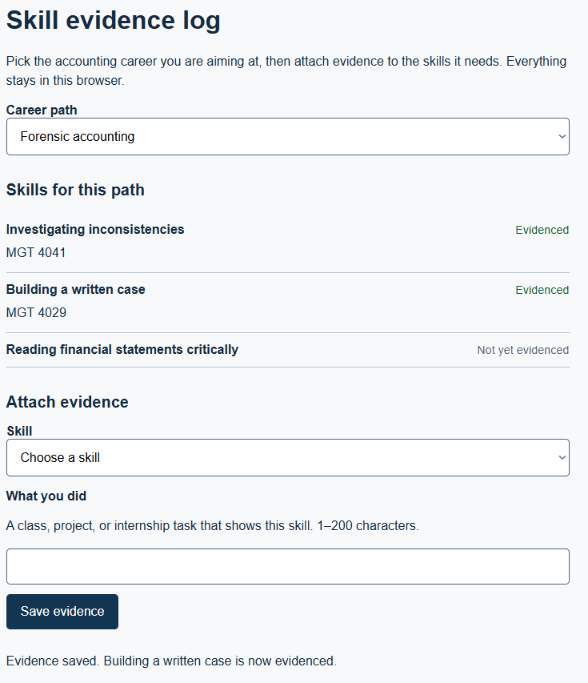
 
This screenshot demonstrates AC-2: after I select a skill and save valid evidence, the skill changes from "Not yet evidenced" to "Evidenced" and the saved evidence appears underneath it.

## How to Run

Create your repository from the this HW3 template and name it `mgt3745-hw3`. The supplied app is a starter; adapt it to one feature from your own specification.
This project runs inside a GitHub Codespace. No local install.

1. On your repository page, click **Code → Codespaces → Create codespace on main**. Wait for setup to finish; first-boot time varies.
2. Keep the supplied `.devcontainer/devcontainer.json`. It configures Live Server installation and port 5500 forwarding. Once the extension is ready, right-click `index.html` and choose **Open with Live Server**, or use **Go Live**.
3. If a browser tab does not open, use the **Ports** tab to open port 5500. Keep its visibility **Private**.
4. With Live Server running, save your edits to reload the page.

If Live Server is unavailable, run `node scripts/serve.mjs` in the terminal, then open port 5500 from the Ports tab. Refresh the browser after edits when using this fallback; stop it with **Ctrl+C**. Run only one server on port 5500 at a time. The fallback also works locally with Node 22 or later. Serve over HTTP rather than opening `index.html` through `file://`.

## How It Works

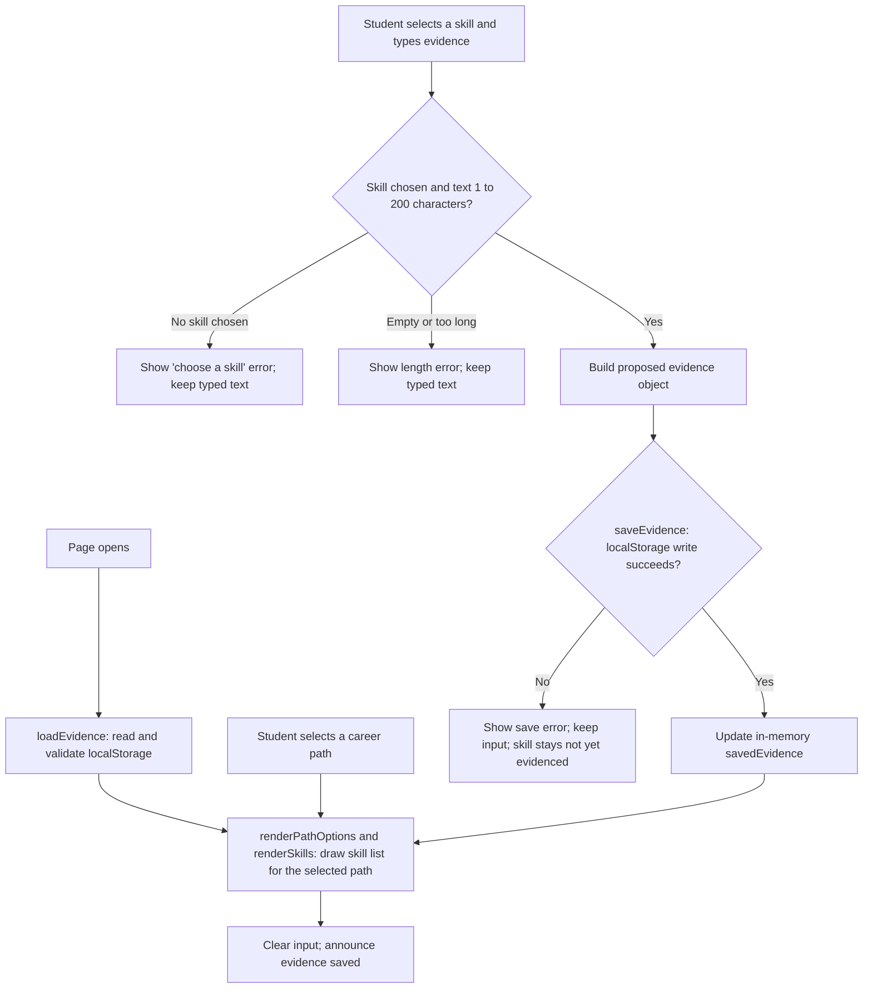

This diagram describes the built F-03 feature, not the original starter's notes app. In `app.js`, `loadEvidence` reads and validates stored data from localStorage on page load, returning an empty record rather than crashing if the stored data is missing or malformed. `renderPathOptions` fills the career-path dropdown once; `renderSkills` redraws the skill list and the skill dropdown whenever the selected path changes or evidence is saved, reading each skill's status from `savedEvidence`.
 
The form's submit handler validates in order: it rejects an empty skill selection first, then rejects text outside 1 to 200 characters, showing a distinct error message for each case and leaving the typed text in place either way. Only after both checks pass does it build a proposed evidence object and call `saveEvidence`, which persists to localStorage before any visible state changes. If the write throws (including the `?failSave` simulated failure used for AC-4), the function shows an error and returns `false`; the submit handler then returns early, so `savedEvidence` and the rendered list are never updated on a failed save. This ordering, write first, then update visible state, is why a failed save cannot show evidence that was never actually stored.

## Status

| Area | State | Why |
|---|---|---|
| Career path and skill display | Works | AC-1 passed |
| Evidence save and display | Works | AC-2 passed |
| Invalid input | Works | AC-3 passed |
| Save failure handling | Works | AC-4 passed |
| Persistence after reload | Works | Persistence check passed |
| Peer comparison | Deferred/not included | Outside F-03 scope |
| Inactive career paths | Deferred | ADR-001 |

Verification results (click to expand)

## Verification Summary

The full verification record is in [FEATURES.md](context/FEATURES.md), under the Verification section.
 
| Criterion / EARS statement | Steps and input | Expected result | Observed result | Status | Evidence / commit |
|---|---|---|---|---|---|
| AC-1: WHEN the student selects a career path, THE SYSTEM SHALL display the associated skills within 2 seconds. | Select Audit or Forensic Accounting. | Associated skills appear within 2 seconds. | Skills changed immediately after selecting the career path. | PASS | 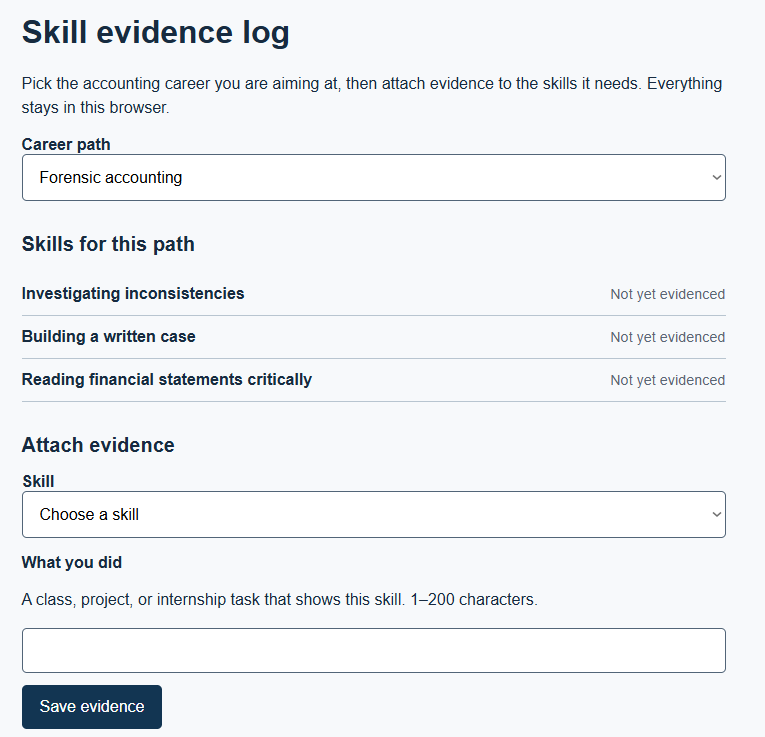 |
| AC-2: WHEN the student attaches valid evidence to a selected skill, THE SYSTEM SHALL save the evidence and mark the skill as "Evidenced." | Select a skill, enter `MGT 4029`, and click Save. | Evidence is saved and the skill changes to "Evidenced." | Evidence appeared and the skill changed to "Evidenced." | PASS | 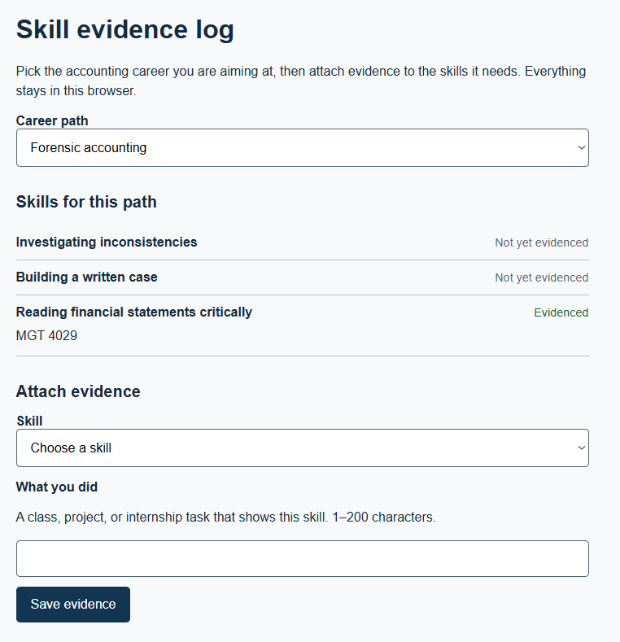 |
| AC-3: WHEN the student tries to save without a skill or without evidence, THE SYSTEM SHALL show an error and preserve the entered text. | Test with no skill selected, then test with an empty evidence field. | An error appears and invalid input is not saved. | Error messages appeared and the entered text was preserved. | PASS | 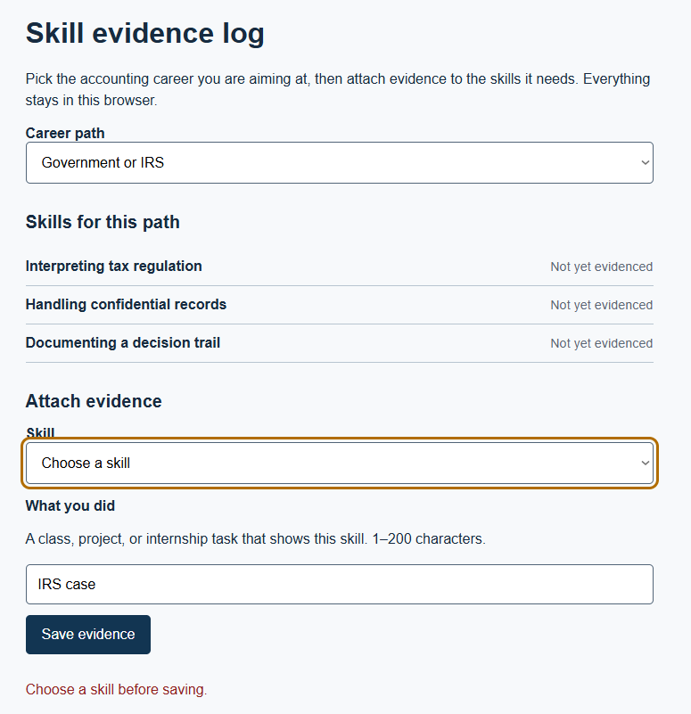, 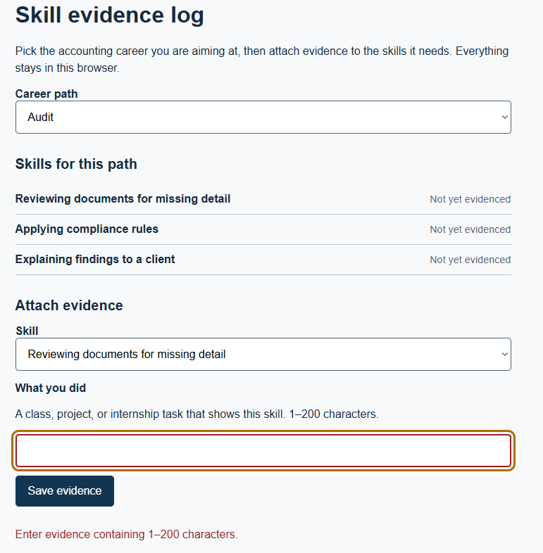 |
| AC-4: WHEN saving fails, THE SYSTEM SHALL keep the entered evidence and show the reason for failure. | Trigger a save failure using `?failSave`. | Error appears, input remains, and skill status does not change. | Save error appeared, evidence text remained, and status did not change. | PASS | 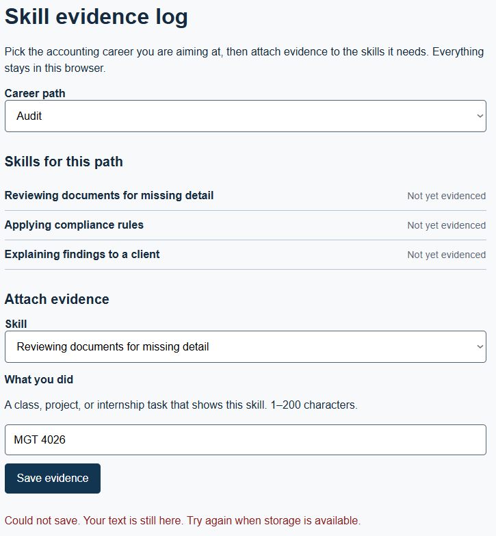 |
| AC-5: WHEN a skill has no attached evidence, THE SYSTEM SHALL display "Not yet evidenced." | Open the Audit Career path before adding evidence. | Skills without evidence show "Not yet evidenced." | All three skills showed "Not yet evidenced." | PASS | 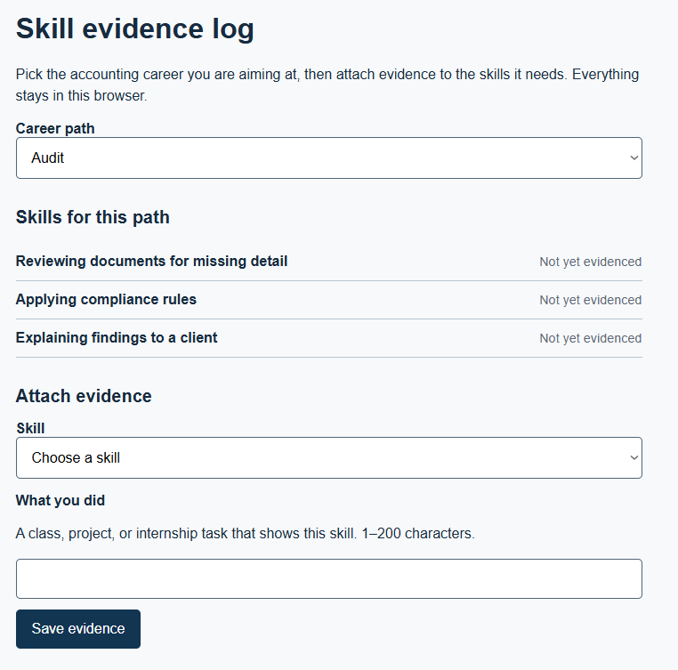 |
| AC-6: WHEN peer comparison is disabled, THE SYSTEM SHALL NOT display or access other students' data. | Check browser Local Storage after saving evidence. | Only the current student's evidence is stored. | Only the entered evidence was present; no other student data appeared. | PASS | 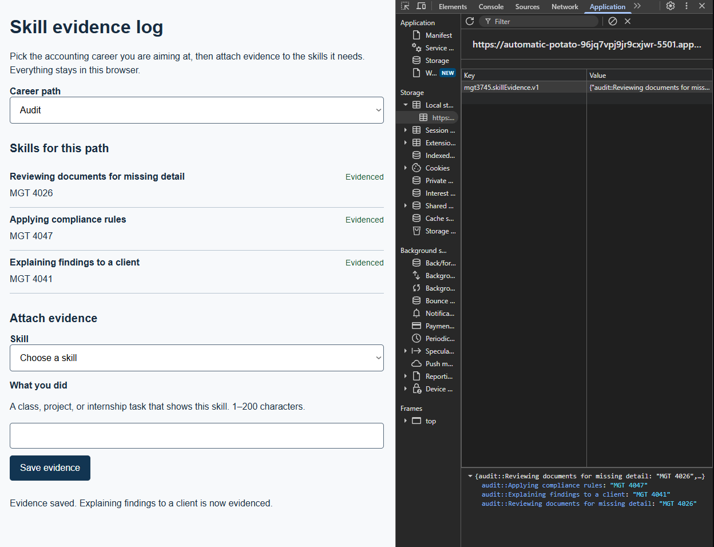 |
| Persistence check: WHEN saved evidence exists, THE SYSTEM SHALL preserve it after reload. | Save evidence, reload the page, and check the skill. | Evidence and "Evidenced" status remain after reload. | Evidence and status remained after reload. | PASS | 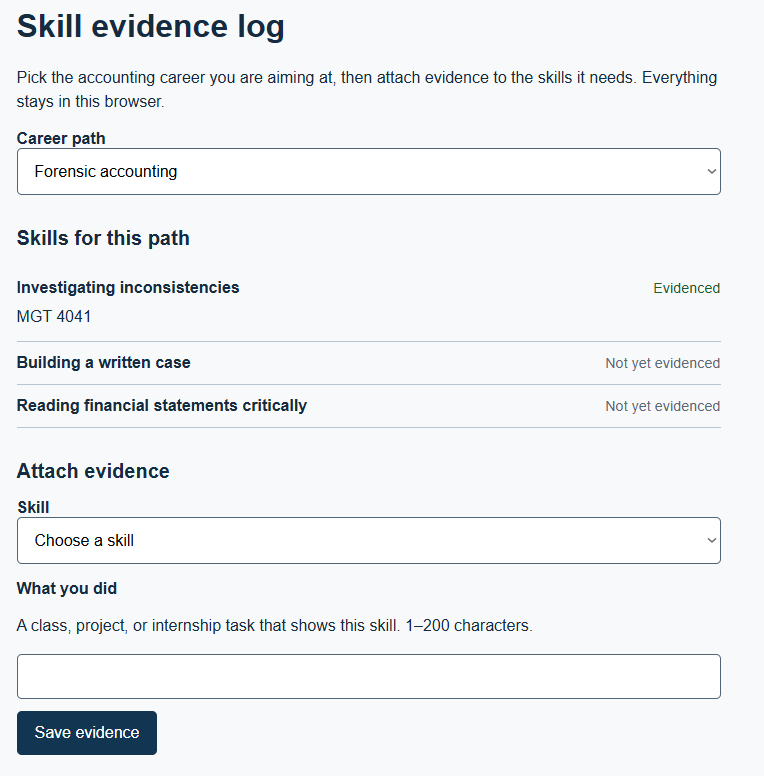 |
| AC-7: WHEN a career path becomes inactive, THE SYSTEM SHALL preserve previously saved evidence. | Not implemented in this build. | Existing evidence would remain if a path became inactive. | Not tested because the inactive-path rule is outside the F-03 build scope. | DEFERRED | [`context/ARCHITECTURE.md`](context/ARCHITECTURE.md) |

## Links

Read in this order:

0. [`SCAFFOLD_MANIFEST.md`](SCAFFOLD_MANIFEST.md): explains what carries over from HW2 into HW3, along with a submission checklist
1. [`context/PROJECT.md`](context/PROJECT.md): the problem and its framing
2. [`context/USERS.md`](context/USERS.md): who this is for
3. [`context/FEATURES.md`](context/FEATURES.md): what it must do, and verification results
4. [`context/ARCHITECTURE.md`](context/ARCHITECTURE.md): the gate and ADR-001
5. [`context/STANDARDS.md`](context/STANDARDS.md): the rules this code follows
6. [`context/CLAUDE.md`](context/CLAUDE.md): the same rules, for agents

The scaffold has **eleven canonical files in `/context`: six active files above and five previews**: [STYLE.md](context/STYLE.md), [TOOLS.md](context/TOOLS.md), [SKILLS.md](context/SKILLS.md), [EVALS.md](context/EVALS.md), and [AGENTS.md](context/AGENTS.md). Keep the previews; verification stays in FEATURES.md until EVALS.md activates in Module 5.

Root README.md and the two instruction adapters—[CLAUDE.md](CLAUDE.md) and [.github/copilot-instructions.md](.github/copilot-instructions.md)—are additional files. Copy your HW2 USERS.md and FEATURES.md into `/context` and revise them using instructor feedback if available; otherwise record a peer criterion check and mark instructor feedback pending. Run `node scripts/check-scaffold.mjs` to check required file presence; this does not assess content quality.

## AI Use

**Tool and task delegated:** I used Claude throughout this assignment. Claude drafted the initial gate table and ADR-001 in ARCHITECTURE.md, the split test reasoning in STANDARDS.md, and the first version of index.html, styles.css, and app.js, built to my HW2 FEATURES.md specification for F-03.
 
**Why:** I am a first-time coder, and the gate itself scores AI-assisted builds low on inspectability for exactly that reason, I needed a starting structure I could then read, test, and hold myself accountable for, rather than a specification I could not act on within a one-week deadline.
 
**How it was checked:** I ran the page in a Codespace via Live Server and tested every acceptance statement by hand, including triggering `?failSave` for AC-4 and doing a real page reload for the persistence check, recording each result in FEATURES.md's Verification table with a screenshot. I also read through app.js function by function and confirmed against context/STANDARDS.md that no `innerHTML` or `console.log` appears anywhere in the code, and that `saveEvidence` writes to localStorage before any visible state changes, which is what makes the AC-4 failure behavior correct.
 
**Observed result / evidence:** AC-1 through AC-6 and the persistence check are recorded as PASS in [FEATURES.md](context/FEATURES.md). AC-7 is correctly marked DEFERRED since it was not implemented in this build. See the Verification table there for the full record.
 
**Instruction discovery and compliance:** Not run. I did not use a live Copilot or Claude Code session inside the repository itself to generate code against `.github/copilot-instructions.md` or `context/CLAUDE.md`; instead I did a manual standards review, confirmed by directly searching app.js and index.html for `innerHTML`, `console.log`, and inline `style=` attributes, and found none.
 
**Actual hours on this assignment:** 14 hours

## Explain, Change, Verify

**The function:** `saveEvidence(proposedEvidence)` takes one input, a proposed version of the entire evidence record (the existing saved evidence plus one new or updated skill entry). It does not modify anything visible on the page itself. Instead it tries to write that proposed record to `localStorage` under the key `mgt3745.skillEvidence.v1`. If the write succeeds, it returns `true`. If it throws, whether from the simulated `?failSave` flag or a real storage failure, it sets an error message in `evidenceError`, clears `saveStatus`, and returns `false`. The caller, the form's submit handler, only updates `savedEvidence` and calls `renderSkills()` if `saveEvidence` returned `true`. That is the whole point of the function: it is the single gate between "the user typed something" and "the page shows something as evidenced."

**The change:** I changed the AC-3 invalid-input error message in `app.js` from `Enter evidence containing 1–200 characters.` to `Please enter 1–200 characters of evidence.` I expected the updated wording to give the student clearer feedback when evidence is empty or outside the allowed character range. Commit: `[commit 7 (Clarify invalid evidence error message)]`.

**What I observed:** After reloading the page in Codespace, I selected a skill and clicked Save with an empty evidence field. The updated error message appeared, the skill remained "Not yet evidenced," and the form did not save the empty evidence. 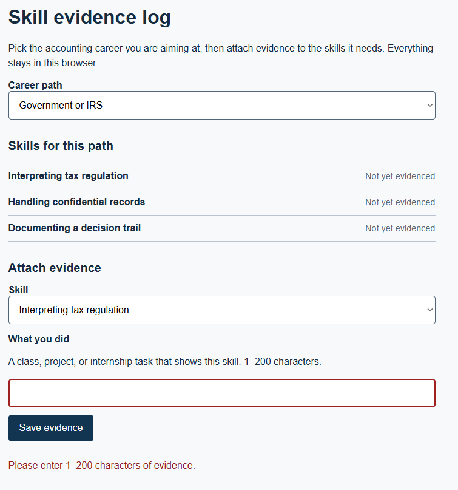

**Why it matters:** This supports AC-3 by giving the student clear feedback about the evidence requirement while preventing invalid evidence from being saved.
